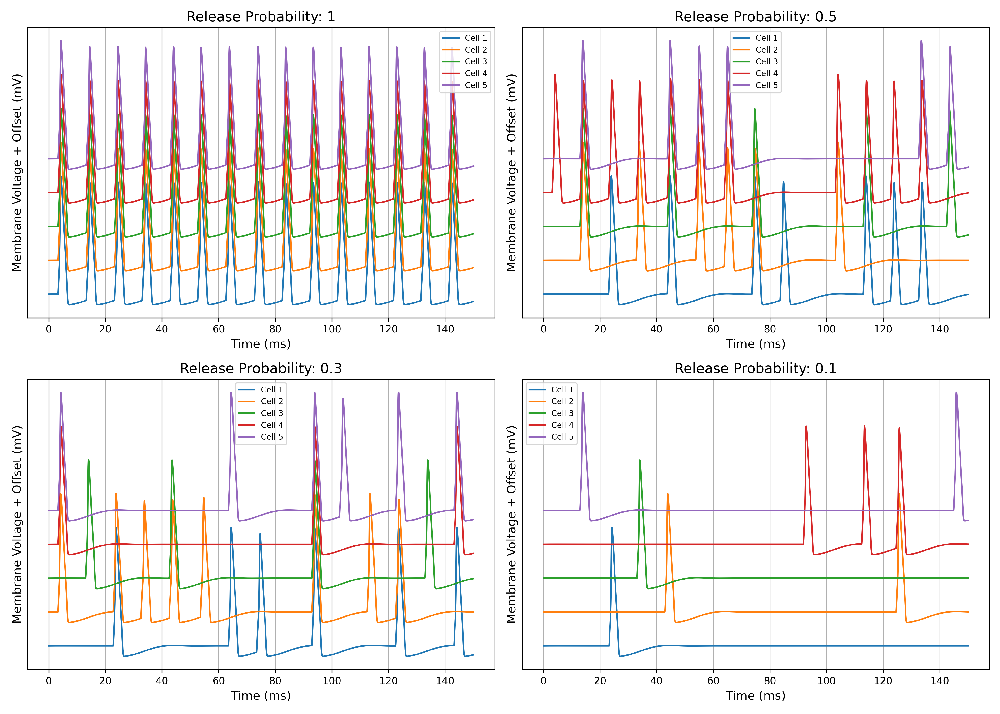
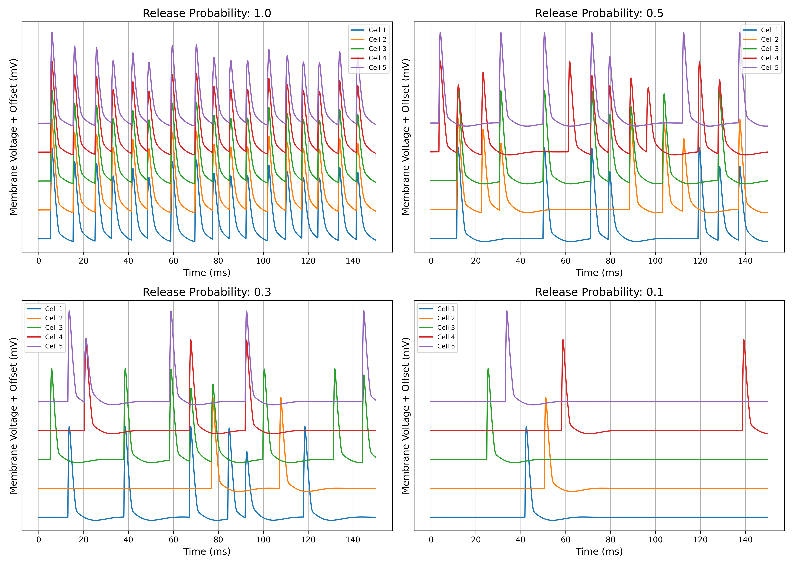

# Stochastic Synapse

This repository extends the conventional  NEURONSs' `Exp2Syn` synapse model to incorporate stochastic vesicle release, providing a more biologically realistic representation of synaptic transmission. We provide seperate mod file one for  `NEURON` and the other one for `CoreNEURON`, ensuring compatibility with GPU-accelerated and large-scale network simulations.

We introduce stochasticity using a release probability mechanism, enabling diverse response patterns across targets—even with shared presynaptic input. The model can be used for both excitatory and inhibitory synapses, and integrates seamlessly with Python-based simulations.

This work is designed to aid researchers exploring probabilistic synaptic dynamics in both small and large network contexts.

## Simulation of Release Probabilities

The Python script (scripts/CoreNEURONtest.py or scripts/NEURONtest.py) sets up a small network of five single-compartment neurons, each modeled as a `Hodgkin-Huxley` soma, to examine the effect of stochastic synaptic release on postsynaptic membrane potential. Each neuron receives input from a shared `NetStim`spike generator, which produces a series of spikes with slight temporal variability. Synaptic transmission is mediated by `StochExp2Syn` synapses in NEURON and `StochExp2SynGPU` synapses in CoreNEURON, implementing probabilistic neurotransmitter release controlled by the release_prob parameter. Random seeds are assigned to each synapse to introduce variability in release timing and location. The simulation records the membrane voltage of each neuron over time, allowing visualization of how different release probabilities (1.0, 0.5, 0.3, 0.1) affect postsynaptic responses. The resulting voltage traces are stacked and plotted, illustrating how increased stochasticity reduces the reliability and amplitude of synaptic responses in this simple network.  

## NEURON

The figure below shows non-overlapping voltage traces of 5 cells receiving shared stochastic input for different synaptic release probabilities (1.0, 0.5, 0.3, 0.1). 

The above figure is generated by running the python script NEURONtest.py from the `src` folder as
`python ../scripts/NEURONtest.py`. Before running the python script, please make sure to compile the mod files in the `src/mod` folder by running the `compile_mod_files.sh` in the same folder (choose either NEURON or CoreNEURON (NOR BOTH) during the compilation). 
 
## CoreNEURON

The implementation of the stochastic synapse for the CoreNEURON is not as straightforward as that of for the NEURON. We adopted a part of the code from the mod file `https://gitlab.ebrains.eu/BlueBrain/efel/-/blob/5.6.17/examples/sonata-network/mechanisms/netstim_inhpoisson.mod` of the [sonata-network](https://gitlab.ebrains.eu/BlueBrain/efel/-/tree/5.6.17/examples/sonata-network), to obtain a CoreNEURON compilation stochastic synapse. 

Thanks to the netstim_inhpoisson.mod file and *to be honest I have not fully understood their implementation*. However, it works in CoreNEURON.

The figure below shows non-overlapping voltage traces of 5 cells receiving shared stochastic input for different synaptic release probabilities (1.0, 0.5, 0.3, 0.1).
  
